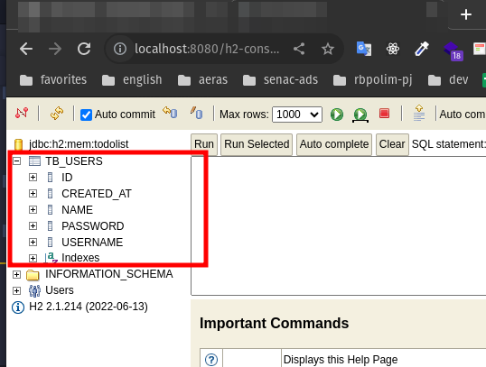
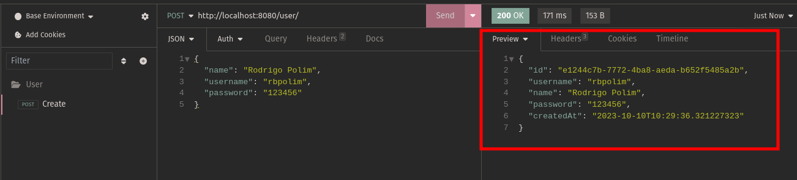
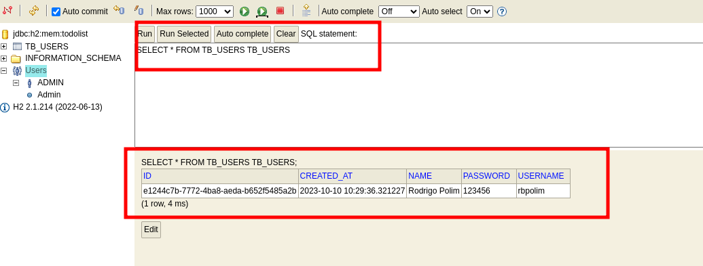
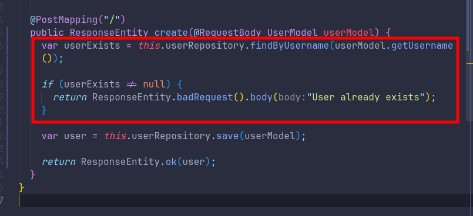
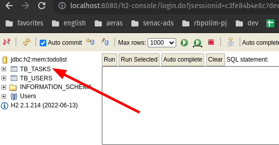
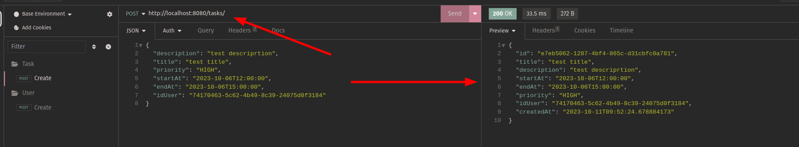
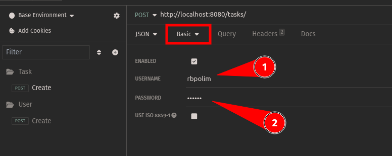

# Semana Java Rocketseat

## Techs

- Java
- Spring Boot
- Lombok

## Aula 2

  - Adicionou dependência do Lombok no pom.xml (https://projectlombok.org/setup/maven);
 
  ```
    <dependency>
      <groupId>org.springframework.boot</groupId>
      <artifactId>spring-boot-starter-test</artifactId>
      <scope>test</scope>
    </dependency>
  ```

  - Adicionado o decorator @Data na classe de modelo (User);
  - Armazenar dados Spring Data JPA (https://spring.io/guides/gs/accessing-data-jpa/);
  - Trabalha com ORM (Object Relational Mapping);
  - Utilizaremos um banco em memoria (H2);
  - Mapeia objetos Java para tabelas do banco de dados;
  - Adicionou dependências do Spring Data JPA no pom.xml (https://spring.io/guides/gs/accessing-data-jpa/);
    

  ```
    <dependency>
      <groupId>org.springframework.boot</groupId>
      <artifactId>spring-boot-starter-data-jpa</artifactId>
    </dependency>

    <dependency>
      <groupId>org.h2database</groupId>
      <artifactId>h2</artifactId>
      <scope>runtime</scope>
    </dependency>
  ```

  - Configurar o H2 
  - No arquivo application.properties, adicionar as seguintes linhas:
    
  ```
    spring.datasource.url=jdbc:h2:mem:todolist
    spring.datasource.driverClassName=org.h2.Driver
    spring.datasource.username=admin
    spring.datasource.password=admin
    spring.jpa.database-platform=org.hibernate.dialect.H2Dialect
    spring.h2.console.enabled=true
  ```

  - Apos rodar o servidor e acessar a URL (http://localhost:8080/h2-console)
  - deve-se configurar o campo JDBC URL com o valor jdbc:h2:mem:todolist e clicar em Connect. 
  
  

#### Tabela Usuario

  - Usamos o conceito de Entidade (Entity) para mapear a tabela Usuario
  - Adicionamos a anotacao @Entity na classe Usuario
  - Adicionamos a anotacao @Id na propriedade id
  - Adicionamos a anotacao @GeneratedValue na propriedade id

  

#### Repositório Usuário

  - Criamos uma interface IUserRepository que extende a interface JpaRepository;
  - A interface JpaRepository possui metodos para manipular dados no banco de dados;
  - A interface JpaRepository recebe dois parametros: a classe de entidade e o tipo de dado da chave primaria;
  - No arquivo UserController foi injetado o IUserRepository;
  - E no método HTTP post foi adicionado o método save do IUserRepository;
  - Testado a criacao de um usuario no banco de dados;
  
  - Resultado do teste no banco de dados:
  

#### Validar Usuário

  - Queremos que a app nao permita a criação de usuários com o mesmo username;
  
  ```
  @Column(unique = true) // Define o atributo como único
  private String username;
  ```

  - Agora iremos criar um novo metodo no IUserRepository para buscar um usuário pelo username;
  
  ```
    UserModel findByUsername(String username);
  ```

  - No UserController, injetamos o IUserRepository e adicionamos o metodo findByUsername;
  - Criamos uma validaçao para verificar se o usuário ja existe no banco de dados;
  


## Aula 3

 #### Criptografia de senha
  
  - Criptografando a senha do usuário com bcrypt
  - Adicionamos a dependência do bcrypt no pom.xml
  - Adicionamos a logica de criptografia no UserController

#### Tabela de Tarefas (tasks)

  - Começo criando o arquivo de modelo Task (TaskModel)
  - Adicionamos as propriedades da tabela Task
  

#### Cadastrar de Tarefas (tasks)

  - Criamos o metodo POST para cadastrar uma tarefa
  

#### Filtro

  - Adicionando validação para criar uma tarefa;
  - Conceito de filtro e Autenticacao (Basic Auth);
  - Crio uma pasta (filter) e arquivo (FilterTaskAuth);
  - Esse arquivo sera um middleware que ira interceptar as requisicoes e verificar se o usuario esta autenticado ou nao;
  - Adicionamos a anotacao @Component para que o Spring entenda que essa classe sera um componente gerenciavel por ele;
  - No Insomnia, adicionamos o username e password no campo Authorization
  

## Aula 4

#### Validando Rotas

  - Dentro do arquivo Filter, pegamos o servletPath da requisicao
  - Criamos uma condicao com a rota `/tasks/` e adicionamos a logica de validacao
  
  ```
  var servletPath = request.getServletPath();
  ```

#### Atributo Request

  - Adicionamos o atributo request no metodo de validacao de usuario
  ```
  request.setAttribute("idUser", user.getId());
  ```
  - Capturamos o atributo request no metodo de criacao de tarefa
  - Setamos o atributo idUser na criacao de tarefa
  ```

#### Validacao Horas

  - Pegamos a data atual e adicionamos as logicas de validacao

#### Listas de Tarefas

  - Pegar a lista de tarefas do usuario logado
  - Criamos um metodo no ITaskRepository para buscar as tarefas pelo id do usuario
  - Criamos um metodo no TaskController para buscar as tarefas pelo id do usuario

#### Update da Tarefa

  - Alterado no Filter o metodo para `startWith()`
  - Criado metodo no TaskController para atualizar uma tarefa

#### Update Parcial da Tarefa

  - Criamos um novo package Utils
  - Criamos um metodo que gerenciar o update parcial da tarefa
  - Dentro do endpoint update nos usamos o metodo do Utils criado
